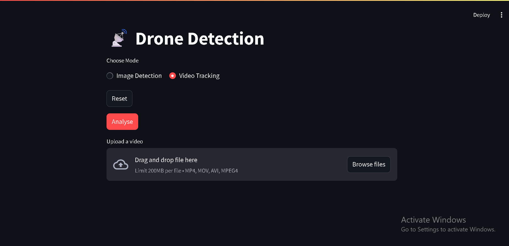

# 🛰 Drone Identification and Tracking

Detects and tracks drones, UCAVs and other flying objects in the provided video and image files.

Created for WESEE, MoD.

---
## 📦 Respository
Clone the functionality-ready project:
```
git clone https://github.com/Eros483/Drone_Identification_and_Tracking
cd Drone_Identification_and_Tracking
```
---
## ⚙️ Environment Setup
1. We recommend using Anaconda for environment control.
2. Create the environment using the provided yml, and activate it.
```
conda env create -f environment.yml
conda activate object
```
---
## 🚀 Running the Frontend
```
streamlit run app.py
```
---
## 🛠️ Frontend Preview

---
## 💡 Project Structure
```
Drone_Identification_and_Tracking
├───custom_dataset_yolo
│   ├───images
│   │   ├───train
│   │   └───val
│   └───labels
│       ├───train
│       └───val
├───dataset
│   ├───test
│   │   ├───images
│   │   └───labels
│   ├───train
│   │   ├───images
│   │   └───labels
│   └───valid
│       ├───images
│       └───labels
├───demo_videos
├───result_videos
├───runs
├───app.py
├───main.ipynb
├───drone.yaml
├───requirements.txt
└───scraper.ipynb
```
---
## 📚 Guide for pipeline utilised
1. For setting up custom dataset:
    - Utilise `scraper.ipynb` to create custom dataset.
        - Uses selenium and bing image search to search and download image relevant to query.
    
    - Download labelImg.exe to manually create labels for each created image.

2. For pre-created dataset on drones:
    - Download dataset via your preferred method from: 
        https://universe.roboflow.com/models/object-detection

3. Use `main.ipynb` and modify paths as per your system path setup.
    - Provides code for sequential training on pre-created dataset, and then the custom dataset.
    - Provides method to save the created model and the pytorch checkpoints for the trained yoloV8 model.
4. Modify `app.py`to run with the updated paths and created model.
5. run the frontend using ```streamlit run app.py```
---
## 🧑🏻‍💻 Working Explaination
#### Objective: The problem statement was to be able to identify and detect movements of both known and suspected drones from images and videos.
#### Solution:
1. Download pre-created dataset on drone images from roboflow.
2. Using `ultralytics` with the `yolov8` model, we trained it over 5 epochs on cpu, which took over 3.8 hours.
    - However, the model was still unable to identify UCAVs, and lacked accuracy on images with suspected drone prescence.
3. Using selenium to create manual image dataset.
    - Utilised `bing` from chrome web drivers in `scraper.ipynb` to be able to automate image download easily.
    - Used a 80-20 train-test split in the images for model training.
    - Used `labelImg` software for labelling images as per requirements of yolov8 which needs sets of images and label.txt files.
        - **Significant Barrier**: LabelImg is a flawed software, with issues in the base code itself, which necessiated changes like typecasting some of the framing variables. 
        - It frequently matched properly saved labels incorrectly, which forced us to restrict ourselves to one image label type.
4. Continued training the model from the previous best checkpoint, on over 20 epochs.
5. Saved the final checkpoint, and loaded it in `app.py` to run on the frontend.
---